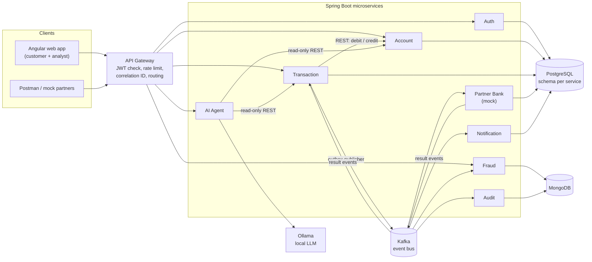
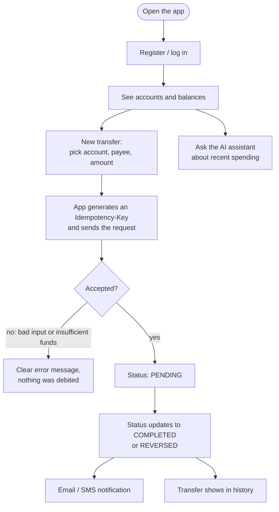
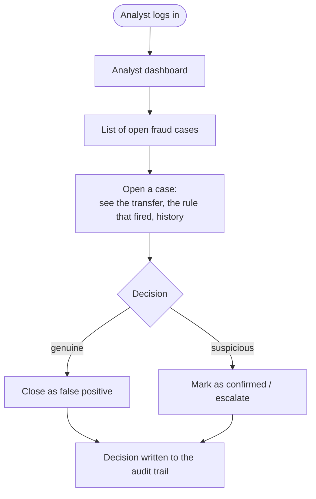
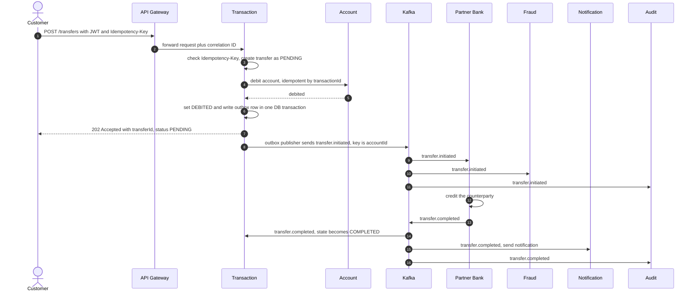
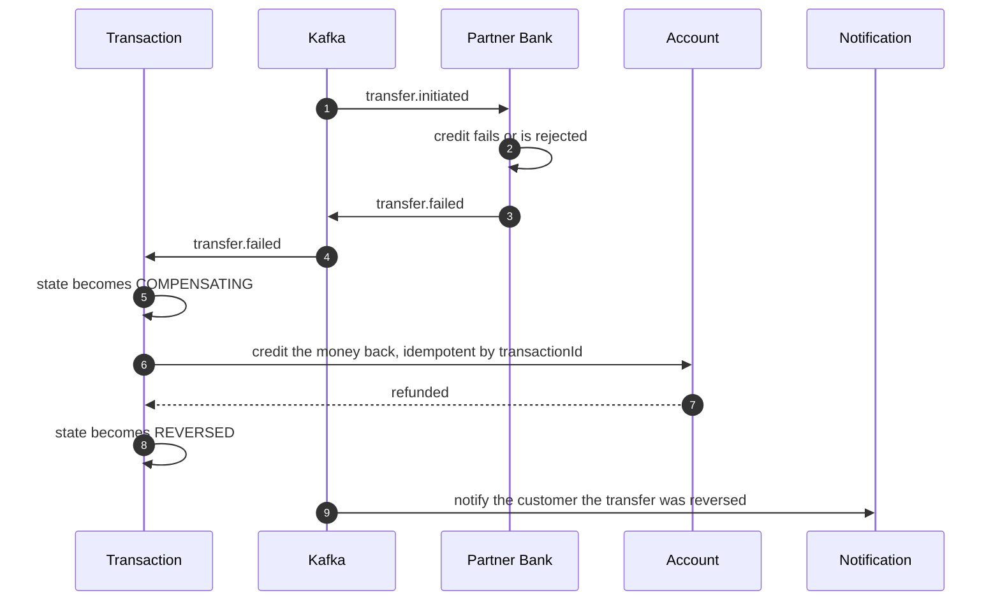
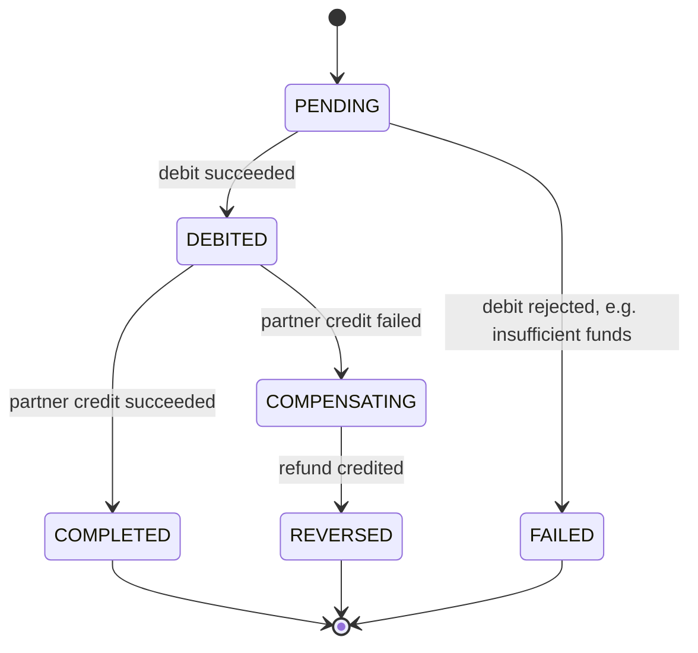
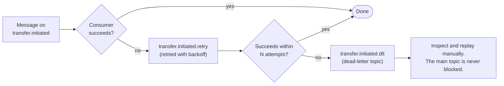

# SentinelBank

**A banking microservices platform built around one hard question: how do you move money correctly when networks fail, messages repeat and services crash?**


> **Project status:** in active development (12-day solo build). The 9 services are scaffolded and the architecture is designed. Business logic is being added service by service. See the [Roadmap](#roadmap) for exactly what is done and what is next. Nothing in this README claims a feature that isn't built yet: anything not finished is marked *planned*.

---

## Table of contents
1. [What is this?](#what-is-this)
2. [Architecture](#architecture)
3. [User flows](#user-flows)
4. [How a money transfer works](#how-a-money-transfer-works)
5. [Key design patterns](#key-design-patterns)
6. [Services](#services)
7. [Tech stack](#tech-stack)
8. [Project layout](#project-layout)
9. [Getting started](#getting-started)
10. [Design decisions and trade-offs](#design-decisions-and-trade-offs)
11. [Roadmap](#roadmap)
12. [Glossary](#glossary)
13. [Author](#author)

---

## What is this?

SentinelBank is a reference implementation of a small retail bank backend and web app. Customers can register, hold accounts and transfer money. Analysts review fraud cases. An AI assistant gives read-only spending advice.

The point of the project is **not** the number of features. It is showing that money-moving code stays correct under the failures that real distributed systems have:

| Real-world failure | What SentinelBank does about it |
|---|---|
| User double-clicks "Send" or the client retries | **Idempotency keys**: the second request returns the first result, money moves once |
| Service crashes between "save to DB" and "publish event" | **Transactional outbox**: the event is saved in the same DB transaction as the change |
| Kafka delivers the same message twice | **Idempotent consumers**: already-processed event IDs are skipped |
| Two requests change the same balance at once | **Optimistic locking** (`@Version`): the loser retries instead of overwriting |
| The partner bank rejects or times out after we debited | **Saga with compensation**: the debit is reversed |
| A message keeps failing | **Retry topics, then a dead-letter topic (DLT)**: it never blocks the queue |
| An LLM could leak data or be tricked into acting | **Guardrails**: read-only tools, PII masking, output validation, local model |

---

## Architecture



**How to read it:** everything a user does enters through the **API Gateway**. Services talk to each other in two ways: **direct REST calls** where an immediate answer is needed (Transaction asks Account to debit), and **Kafka events** where work can happen afterwards and independently (fraud checks, notifications, audit, partner credit). Each service owns its own data.

### Cross-cutting concerns

| Concern | Approach |
|---|---|
| Authentication | JWT issued by Auth, validated at the gateway |
| Tracing a request | A correlation ID is created at the gateway and carried through REST calls, Kafka messages and logs |
| Fault tolerance | Resilience4j (circuit breaker, retry) on service-to-service REST calls |
| Health and metrics | Spring Boot Actuator on every service |
| Deployment | Docker Compose (Kubernetes manifests are *planned*, if time allows) |

---

## User flows

### Customer



### Fraud analyst



Fraud detection is **asynchronous**: rules run when the transfer event is consumed. It flags rather than blocks (see [trade-offs](#design-decisions-and-trade-offs)).

---

## How a money transfer works

This is the heart of the system. The transfer is a **saga**: a sequence of local steps, each with an undo, instead of one big distributed transaction.

### Happy path



### When the partner bank fails (compensation)



### Transfer state machine



### When a message keeps failing



---

## Key design patterns

| Pattern | Where | Why it matters |
|---|---|---|
| **Transactional outbox** | Transaction Service | Saving the change and the "event to publish" in the same DB transaction means we never lose or invent an event when a crash happens between the two |
| **Idempotency keys** | Transaction API | A retried request returns the original result instead of moving money twice |
| **Idempotent consumers** | Fraud, Partner Bank, Notification, Audit | Kafka can deliver twice. Processed event IDs are recorded and skipped |
| **Saga with compensation** | Transaction and Partner Bank | Cross-service consistency without distributed transactions: undo instead of two-phase commit |
| **Optimistic locking** | Account Service (`@Version`) | Concurrent balance updates can't silently overwrite each other |
| **Key by `accountId`** | Kafka producer | Events for one account stay in order, while different accounts still process in parallel |
| **Retry topics and DLT** | All consumers | Poison messages are isolated, not endlessly retried |
| **Append-only audit** | Audit Service | A tamper-evident trail with no update or delete endpoints |
| **Database per service** | All stateful services | Services can't reach into each other's tables. Contracts are APIs and events |
| **Guardrailed AI** | AI Agent | Read-only tools, PII masking before the prompt, output validator, local model |

---

## Services

| Service | Port | Store | Responsibility |
|---|---|---|---|
| `api-gateway` | 8080 | none | Routing, JWT validation, rate limiting, correlation ID |
| `auth-service` | 8081 | PostgreSQL | Registration, login, JWT, refresh tokens, roles, KYC profile |
| `account-service` | 8082 | PostgreSQL | Accounts, balances, ledger entries, idempotent debit/credit |
| `transaction-service` | 8083 | PostgreSQL | Transfer API, idempotency, saga state, outbox |
| `partner-bank-service` | 8084 | PostgreSQL | Mock counterparty bank with a switchable failure mode for demos |
| `fraud-service` | 8085 | MongoDB | Rules engine, fraud cases for analysts |
| `notification-service` | 8086 | PostgreSQL | Email/SMS notifications (MailHog locally), retry topic |
| `audit-service` | 8087 | MongoDB | Append-only event trail |
| `ai-agent-service` | 8088 | none | Read-only spending advice via Spring AI and a local Ollama model |

Infrastructure ports: PostgreSQL 5432, MongoDB 27017, Kafka 9092, MailHog 1025 (SMTP) and 8025 (UI), Ollama 11434.

### Kafka topics

| Topic | Produced by | Consumed by |
|---|---|---|
| `transfer.initiated` | Transaction (via outbox) | Partner Bank, Fraud, Audit |
| `transfer.completed` | Partner Bank | Transaction, Notification, Audit |
| `transfer.failed` | Partner Bank | Transaction, Notification, Audit |

Each topic also has a `.retry` and a `.dlt` companion. Messages are keyed by `accountId`.

---

## Tech stack

| Area | Technology |
|---|---|
| Language / runtime | Java 25 |
| Framework | Spring Boot 4.1, Spring Cloud Gateway (reactive), Spring Security, Spring Data JPA, Spring Data MongoDB, Spring for Apache Kafka, Spring AI |
| Resilience | Resilience4j |
| Databases | PostgreSQL (Flyway migrations), MongoDB |
| Messaging | Apache Kafka (KRaft mode) |
| AI | Spring AI with Ollama (local LLM) |
| Frontend | Angular |
| Testing | JUnit 5, Testcontainers |
| Build / run | Maven (wrapper per service), Docker Compose |

---

## Project layout

```
sentinelbank/
├── common/                  shared library (event envelope, correlation-ID filter, errors, idempotency)
├── services/                one Maven project per service
│   ├── api-gateway/
│   ├── auth-service/
│   ├── account-service/
│   ├── transaction-service/
│   ├── partner-bank-service/
│   ├── fraud-service/
│   ├── notification-service/
│   ├── audit-service/
│   └── ai-agent-service/
├── frontend/                Angular app (customer views and a role-guarded /analyst area)
├── infra/                   docker-compose.yml and database init scripts
├── docs/                    extra design notes
└── PLAN.md                  the 12-day build plan
```

Base package per service: `com.sentinelbank.<name>` (for example `com.sentinelbank.transaction`).

---

## Getting started

**Prerequisites:** JDK 25, Docker Desktop, Node.js (for the Angular app). Maven is not needed, since each service ships with `./mvnw`.

> The commands below are the **planned** workflow. The infrastructure file (`infra/docker-compose.yml`) lands in the next roadmap step, so they won't work until it does.

```bash
# 1. Start infrastructure: PostgreSQL, MongoDB, Kafka, MailHog  (planned)
docker compose -f infra/docker-compose.yml up -d

# 2. Run a service, for example the gateway  (works once the service has its config)
cd services/api-gateway
./mvnw spring-boot:run

# 3. Run the Angular app  (planned, Day 9)
cd frontend
npm install && npm start
```

### Demo script (planned, Day 12)
1. Register and log in.
2. Make a transfer, then check that balances changed, an audit event exists and a notification was sent.
3. Repeat the request with the same `Idempotency-Key` and check that nothing moves twice.
4. Switch on the Partner Bank failure mode and check that the transfer ends `REVERSED`.
5. Send a large or rapid transfer and check that a fraud case appears in the analyst view.

---

## Design decisions and trade-offs

Honest notes on what was chosen, and what it costs.

- **Fraud checks are asynchronous.** Rules run after the event is published, so they *flag* suspicious transfers instead of *blocking* them. A production bank would add a pending-review state or a synchronous pre-check for high-risk transfers.
- **Debit is a synchronous call, the rest is event-driven.** The Account debit and the outbox row are in two different databases, so they are not atomic. Safety comes from the debit being idempotent by `transactionId` and from the explicit `PENDING` / `DEBITED` states, so a crash mid-way can be retried cleanly.
- **Outbox uses polling.** Simple and dependable. Change-data-capture (for example Debezium) would cut latency and DB load and is the natural upgrade.
- **Two databases, not three.** The original design also used MySQL. It was merged into PostgreSQL to keep the operational load realistic for a small team. Each service still owns its own schema.
- **Compose instead of Kubernetes for now.** Docker Compose is the deployment target. Kubernetes manifests (namespaces, deployments and HPA, ingress, config and secrets) are a stretch goal.
- **Simplified platform pieces.** Static gateway routes instead of Eureka, plain config files instead of a config server, structured JSON logs with a correlation ID instead of a full ELK stack.

---

## Roadmap

Legend: ✅ done · 🚧 in progress · ⬜ planned

| Day | Focus | Status |
|---|---|---|
| 1 | Foundation: repo layout, the 9 service skeletons, infra compose file, `common` module | 🚧 skeletons done |
| 2 | Auth service and gateway (JWT, routing, rate limit) | ⬜ |
| 3 | Account service (ledger, optimistic locking, idempotent debit/credit) | ⬜ |
| 4 | Transaction service (transfer API, idempotency, saga state, outbox) | ⬜ |
| 5 | Outbox publisher and Kafka topics | ⬜ |
| 6 | Partner Bank, saga completion, compensation, retry and DLT | ⬜ |
| 7 | Fraud service (rules, cases) | ⬜ |
| 8 | Notification and Audit services | ⬜ |
| 9 | Angular app (customer and analyst views) | ⬜ |
| 10 | Hardening and integration tests (Testcontainers) | ⬜ |
| 11 | AI agent (thin, read-only) and buffer | ⬜ |
| 12 | Polish, README, demo script, optional Kubernetes | ⬜ |

The detailed plan, including the cut line if time runs short, is in [PLAN.md](PLAN.md).

---

## Glossary

| Term | Plain-English meaning |
|---|---|
| **Microservice** | A small, separately deployed program that owns one business capability |
| **API Gateway** | The single front door. It checks who you are and routes you to the right service |
| **JWT** | A signed token proving who you are, so services don't need your password again |
| **Kafka** | A durable message log. Services publish events to it, and other services read them at their own pace |
| **Idempotent** | Doing it twice has the same effect as doing it once (a retried transfer doesn't move money twice) |
| **Outbox pattern** | Save "I must publish this event" in the same database transaction as the data change, and publish it afterwards |
| **Saga** | A long operation split into local steps, each with an undo, instead of one giant transaction |
| **Compensation** | The "undo" step of a saga, for example refunding a debit |
| **Optimistic locking** | Assume no conflict, detect one at save time with a version number, and retry if it happened |
| **DLT (dead-letter topic)** | The parking place for messages that keep failing, so they don't block others |
| **Ledger** | The append-only list of debits and credits. The balance is the sum of it |
| **KYC** | "Know your customer": the identity details a bank must hold |

---

## Author

**Shaik Nayeem Basha**, backend developer focused on Java, Spring Boot and event-driven systems.
GitHub: [@Nayeemshaik29](https://github.com/Nayeemshaik29)
