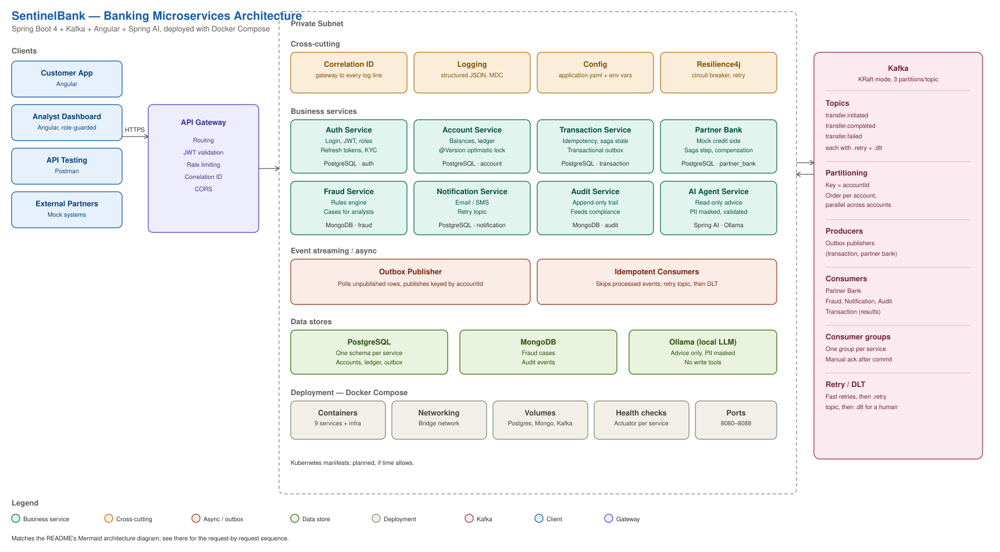
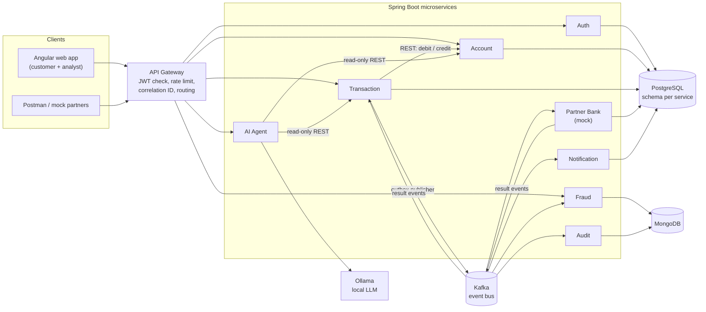
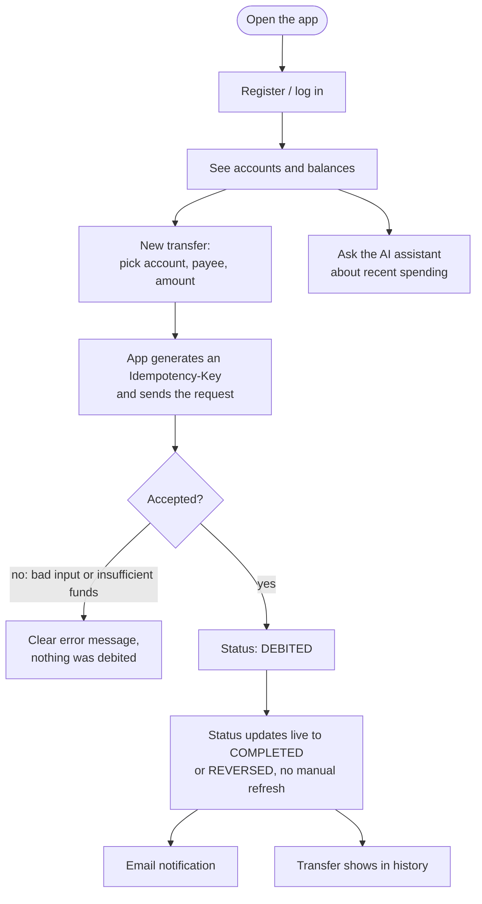
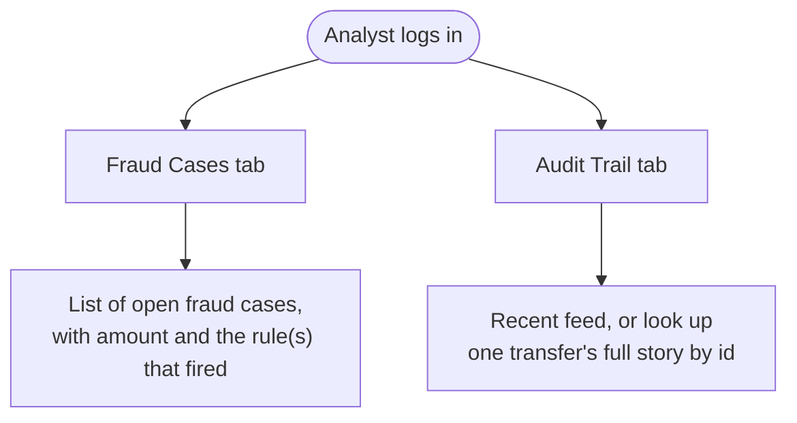
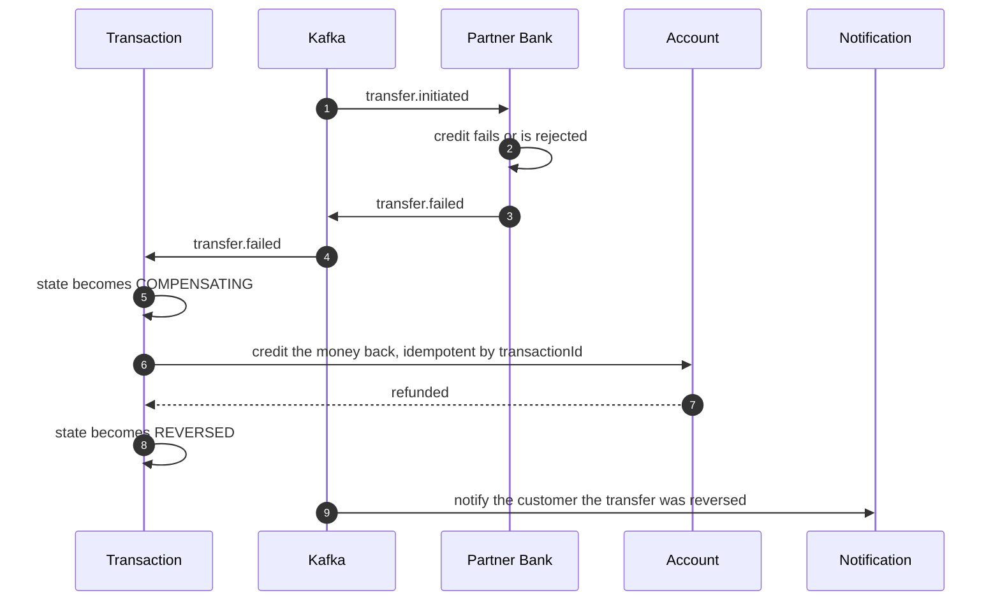
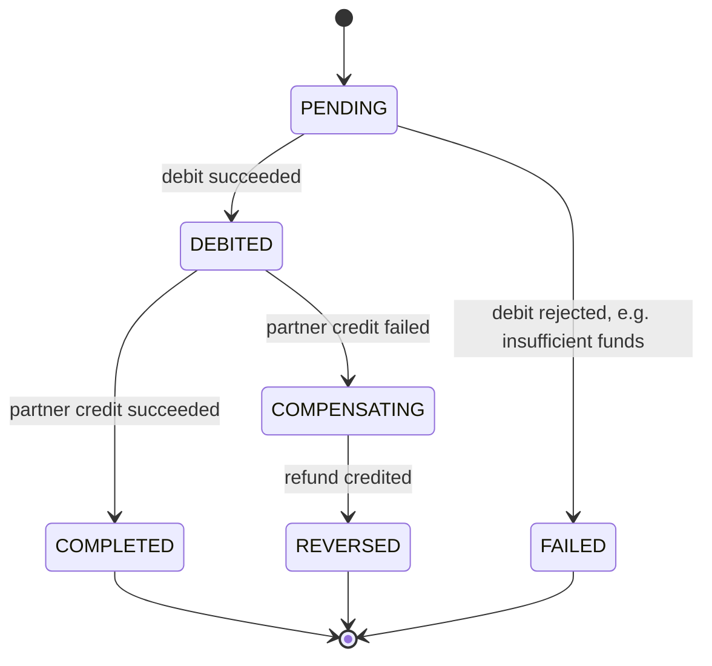
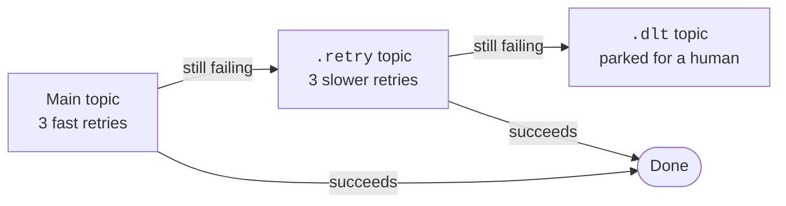

# SentinelBank

**A banking microservices platform built around one hard question: how do you move money correctly when networks fail, messages repeat and services crash?**


> **Project status:** in active development (12-day solo build). Days 1-9 are done: the 9 services are scaffolded, the shared `common` library exists, the local infrastructure (PostgreSQL, MongoDB, Kafka, MailHog) starts with one command, **login, JWT security and the API gateway work end to end**, the **account ledger enforces optimistic locking and idempotency under real concurrency**, **transfers debit an account and write a transactional outbox row atomically**, a **poller reliably publishes those rows to Kafka**, and — the plan's own go/no-go checkpoint — **the full saga runs end to end**: partner-bank-service consumes, credits and publishes a result; transaction-service consumes that result and either completes the transfer or **compensates it, refunding the customer automatically**, all backed by a real two-tier retry-then-dead-letter-topic mechanism. **fraud-service watches every transfer asynchronously**, opening a case in MongoDB when a rule fires (large amount, round amount, velocity, new beneficiary), idempotently and visible only to analysts. **notification-service emails the customer** when a transfer completes or fails (MailHog locally), and **audit-service keeps a complete, append-only trail** of every `transfer.*` event, both as independent consumer groups off the same events everyone else already reacts to. **The whole flow is now driven from a real Angular UI**: login and registration, opening accounts and reading their ledgers, sending transfers with live status updates as the saga settles, and a role-guarded `/analyst` area for fraud cases and the audit trail. Business logic is being added service by service. See the [Roadmap](#roadmap) for exactly what is done and what is next. Nothing in this README claims a feature that isn't built yet: anything not finished is marked *planned*.

---

## Table of contents
1. [What is this?](#what-is-this)
2. [Architecture](#architecture)
3. [User flows](#user-flows)
4. [How a money transfer works](#how-a-money-transfer-works)
5. [Key design patterns](#key-design-patterns)
6. [Services](#services)
7. [Tech stack](#tech-stack)
8. [Project layout](#project-layout)
9. [Getting started](#getting-started)
10. [Design decisions and trade-offs](#design-decisions-and-trade-offs)
11. [Roadmap](#roadmap)
12. [Glossary](#glossary)
13. [Author](#author)

---

## What is this?

SentinelBank is a reference implementation of a small retail bank backend and web app. Customers can register, hold accounts and transfer money. Analysts review fraud cases. An AI assistant gives read-only spending advice.

The point of the project is **not** the number of features. It is showing that money-moving code stays correct under the failures that real distributed systems have:

| Real-world failure | What SentinelBank does about it |
|---|---|
| User double-clicks "Send" or the client retries | **Idempotency keys**: the second request returns the first result, money moves once |
| Service crashes between "save to DB" and "publish event" | **Transactional outbox**: the event is saved in the same DB transaction as the change |
| Kafka delivers the same message twice | **Idempotent consumers**: already-processed event IDs are skipped |
| Two requests change the same balance at once | **Optimistic locking** (`@Version`): the loser retries instead of overwriting |
| The partner bank rejects or times out after we debited | **Saga with compensation**: the debit is reversed |
| A message keeps failing | **Retry topics, then a dead-letter topic (DLT)**: it never blocks the queue |
| An LLM could leak data or be tricked into acting | **Guardrails**: read-only tools, PII masking, output validation, local model |

---

## Architecture



The diagram above is the quick visual reference. The one below is the same system as a Mermaid flowchart, which GitHub renders natively and which stays text-searchable and diffable as the project changes:



**How to read it:** everything a user does enters through the **API Gateway**. Services talk to each other in two ways: **direct REST calls** where an immediate answer is needed (Transaction asks Account to debit), and **Kafka events** where work can happen afterwards and independently (fraud checks, notifications, audit, partner credit). Each service owns its own data.

### Cross-cutting concerns

| Concern | Approach |
|---|---|
| Authentication | JWT issued by Auth, validated at the gateway |
| Tracing a request | A correlation ID is created at the gateway and carried through REST calls, Kafka messages and logs |
| Fault tolerance | Resilience4j (circuit breaker, retry) on service-to-service REST calls |
| Health and metrics | Spring Boot Actuator on every service |
| Deployment | Docker Compose (Kubernetes manifests are *planned*, if time allows) |

---

## User flows

### Customer



### Fraud analyst



Fraud detection is **asynchronous**: rules run when the transfer event is consumed. It flags rather than blocks (see [trade-offs](#design-decisions-and-trade-offs)). Deciding a case — closing it as a false positive or confirming and escalating it — is a **planned** feature, not a built one: fraud-service only creates and lists cases today (`CaseStatus` already has `CONFIRMED` and `CLOSED_FALSE_POSITIVE` values reserved for it, per its own javadoc), and there is no UI or API to change a case's status yet.

---

## How a money transfer works

This is the heart of the system. The transfer is a **saga**: a sequence of local steps, each with an undo, instead of one big distributed transaction.

### Happy path


### When the partner bank fails (compensation)



### Transfer state machine



### When a message keeps failing


---

## Key design patterns

| Pattern | Where | Why it matters |
|---|---|---|
| **Transactional outbox** | Transaction Service | Saving the change and the "event to publish" in the same DB transaction means we never lose or invent an event when a crash happens between the two |
| **Idempotency keys** | Transaction API | A retried request returns the original result instead of moving money twice |
| **Idempotent consumers** | Fraud, Partner Bank, Notification, Audit | Kafka can deliver twice. Processed event IDs are recorded and skipped |
| **Saga with compensation** | Transaction and Partner Bank | Cross-service consistency without distributed transactions: undo instead of two-phase commit |
| **Optimistic locking** | Account Service (`@Version`) | Concurrent balance updates can't silently overwrite each other |
| **Key by `accountId`** | Kafka producer | Events for one account stay in order, while different accounts still process in parallel |
| **Retry topics and DLT** | All consumers | Poison messages are isolated, not endlessly retried |
| **Append-only audit** | Audit Service | A tamper-evident trail with no update or delete endpoints |
| **Database per service** | All stateful services | Services can't reach into each other's tables. Contracts are APIs and events |
| **Guardrailed AI** | AI Agent | Read-only tools, PII masking before the prompt, output validator, local model |

---

## Services

| Service | Port | Store | Responsibility |
|---|---|---|---|
| `api-gateway` | 8080 | none | Routing, JWT validation, rate limiting, correlation ID |
| `auth-service` | 8081 | PostgreSQL | Registration, login, JWT, refresh tokens, roles, KYC profile |
| `account-service` | 8082 | PostgreSQL | Accounts, balances, ledger entries, idempotent debit/credit |
| `transaction-service` | 8083 | PostgreSQL | Transfer API, idempotency, saga state, outbox |
| `partner-bank-service` | 8084 | PostgreSQL | Mock counterparty bank with a switchable failure mode for demos |
| `fraud-service` | 8085 | MongoDB | Rules engine, fraud cases for analysts |
| `notification-service` | 8086 | PostgreSQL | Email/SMS notifications (MailHog locally), retry topic |
| `audit-service` | 8087 | MongoDB | Append-only event trail |
| `ai-agent-service` | 8088 | none | Read-only spending advice via Spring AI and a local Ollama model |

Infrastructure ports (on your machine): PostgreSQL **5433** (mapped away from 5432 so it never clashes with a Postgres you may already run), MongoDB 27017, Kafka 9092, MailHog 1025 (SMTP) and 8025 (UI), Ollama 11434.

### Kafka topics

| Topic | Produced by | Consumed by |
|---|---|---|
| `transfer.initiated` | Transaction (via outbox) | Partner Bank, Fraud, Audit |
| `transfer.completed` | Partner Bank | Transaction, Notification, Audit |
| `transfer.failed` | Partner Bank | Transaction, Notification, Audit |

Each topic also has a `.retry` and a `.dlt` companion. Messages are keyed by `accountId`.

---

## Tech stack

| Area | Technology |
|---|---|
| Language / runtime | Java 25 |
| Framework | Spring Boot 4.1, Spring Cloud Gateway (reactive), Spring Security, Spring Data JPA, Spring Data MongoDB, Spring for Apache Kafka, Spring AI |
| Resilience | Resilience4j |
| Databases | PostgreSQL (Flyway migrations), MongoDB |
| Messaging | Apache Kafka (KRaft mode) |
| AI | Spring AI with Ollama (local LLM) |
| Frontend | Angular 22 (standalone components, signals, zoneless) |
| Testing | JUnit 5, Testcontainers |
| Build / run | Maven (wrapper per service), Docker Compose |

---

## Project layout

```
sentinelbank/
├── common/                  shared library (correlation ID, error model, event envelope, topic names)
├── services/                one Maven project per service
│   ├── api-gateway/
│   ├── auth-service/
│   ├── account-service/
│   ├── transaction-service/
│   ├── partner-bank-service/
│   ├── fraud-service/
│   ├── notification-service/
│   ├── audit-service/
│   └── ai-agent-service/
├── frontend/                Angular app (customer views and a role-guarded /analyst area)
├── infra/                   docker-compose.yml and database init scripts
├── docs/                    extra design notes
└── PLAN.md                  the 12-day build plan
```

Base package per service: `com.sentinelbank.<name>` (for example `com.sentinelbank.transaction`).

---

## Getting started

**Prerequisites:** JDK 25, Docker Desktop, Node.js (for the Angular app). Maven is not needed, since each service ships with `./mvnw`.

```bash
# 1. Start infrastructure: PostgreSQL, MongoDB, Kafka (topics are created automatically), MailHog
docker compose -f infra/docker-compose.yml up -d

# 2. Build everything from the repo root (common library + all 9 services)
./mvnw -DskipTests package

# 3. Run a service, for example the gateway  (services get their config as they are implemented)
cd services/api-gateway
./mvnw spring-boot:run

# 4. Run the Angular app, once at least auth/account/transaction/api-gateway are up
cd frontend
npm install && npm start   # http://localhost:4200
```

What step 1 gives you:

| Piece | Where | Notes |
|---|---|---|
| PostgreSQL 17 | `localhost:5433`, db `sentinelbank`, user/password `sentinel` | One schema per service (`auth`, `account`, `transaction`, `partner_bank`, `notification`). Local dev credentials only |
| MongoDB 8 | `localhost:27017` | Used by `fraud-service` and `audit-service` |
| Kafka 4 (KRaft) | `localhost:9092` | The 3 topics plus `.retry` and `.dlt` companions are created on start |
| MailHog | SMTP `localhost:1025`, UI http://localhost:8025 | Catches the emails `notification-service` sends |

To stop everything: `docker compose -f infra/docker-compose.yml down` (add `-v` to also wipe the data).

### What you can try today (Days 1-9)

Start the infrastructure (above), install the shared library once, then run eight services in separate terminals (a ninth terminal, `cd frontend && npm install && npm start`, gives you the actual Angular UI at `http://localhost:4200` instead of curl — see [Angular app](#angular-app-day-9) below):

```bash
./mvnw -q -pl common install
```

```bash
cd services/auth-service && ./mvnw spring-boot:run
```

```bash
cd services/account-service && ./mvnw spring-boot:run
```

```bash
cd services/transaction-service && ./mvnw spring-boot:run
```

```bash
cd services/partner-bank-service && ./mvnw spring-boot:run
```

```bash
cd services/fraud-service && ./mvnw spring-boot:run
```

```bash
cd services/notification-service && ./mvnw spring-boot:run
```

```bash
cd services/audit-service && ./mvnw spring-boot:run
```

```bash
cd services/api-gateway && ./mvnw spring-boot:run
```

Everything goes through the gateway on `http://localhost:8080`. The gateway strips `/api`, so `/api/auth/login` reaches the auth service as `/auth/login`.

| Request (via the gateway) | Who can call it | What it does |
|---|---|---|
| `POST /api/auth/register` | anyone | Creates a `CUSTOMER` account (KYC starts as `PENDING`) |
| `POST /api/auth/login` | anyone | Returns a 15-minute access token and a 7-day refresh token |
| `POST /api/auth/refresh` | anyone with a refresh token | Swaps it for a new pair; the old refresh token dies |
| `POST /api/auth/logout` | anyone with a refresh token | Revokes that refresh token |
| `GET /api/auth/me` | any signed-in user | Returns your profile |

Two demo accounts are created on first start (local development only, switch off with `SEED_DEMO_USERS=false`):
`customer@sentinelbank.dev` and `analyst@sentinelbank.dev`, both with the password `Demo#12345` (override with `SEED_PASSWORD`).

```bash
curl -s -X POST http://localhost:8080/api/auth/login -H 'Content-Type: application/json' -d '{"email":"customer@sentinelbank.dev","password":"Demo#12345"}'
```

Who may reach which path is decided in one place, the gateway:

| Path | Access |
|---|---|
| `/api/auth/register`, `login`, `refresh`, `logout`, `/actuator/health` | public |
| `/api/fraud/**`, `/api/audit/**` | `ANALYST` only |
| `/api/transfers/**`, `/api/ai/**` | `CUSTOMER` only |
| everything else | any signed-in user |

notification-service has no gateway route at all: it has no customer- or analyst-facing API, only a
background Kafka consumer (see below).

#### Accounts and the ledger (Day 3)

| Request (via the gateway) | Who can call it | What it does |
|---|---|---|
| `POST /api/accounts` | any signed-in user | Opens an account (`{"currency":"USD"}`), balance starts at 0 |
| `GET /api/accounts` | any signed-in user | Lists your own accounts |
| `GET /api/accounts/{id}` | owner, or an `ANALYST` | Balance and status. A non-owner gets `404`, not `403`, so an account's existence is never leaked |
| `GET /api/accounts/{id}/ledger` | owner, or an `ANALYST` | Every debit and credit, newest first |

Balances are a whole number of the smallest currency unit (`balanceMinor`, cents for USD), never a float. Two demo accounts (USD 5,000.00 and USD 10,000.00) are seeded under a fixed placeholder owner id, for trying the ledger with curl or Postman before a real registered customer opens one; disable with `SEED_DEMO_ACCOUNTS=false`.

**Debit and credit are not reachable through the gateway or by any customer.** They live at `POST /internal/accounts/{id}/debit` and `/credit`, directly on the account service's own port (`8082`) — a completely different path from `/accounts/**`, so no gateway route can ever forward to them. Only transaction-service calls them (below), passing:
- `referenceId`: the idempotency key. The same debit request repeated any number of times moves money exactly once and returns the same result.
- `amountMinor`: must be positive.

```bash
# this is exactly what transaction-service does: call account-service directly, not through the gateway
curl -s -X POST http://localhost:8082/internal/accounts/<accountId>/debit \
  -H 'Content-Type: application/json' \
  -d '{"referenceId":"txn-123","amountMinor":2500,"description":"groceries"}'
```

Two guarantees worth knowing about, both proven by tests running 10-16 threads at once against a real PostgreSQL container:
- **Optimistic locking** (`@Version`): concurrent debits on the same account never lose an update. The loser of a write race is retried automatically in a fresh transaction, up to 10 times.
- **Idempotency**: whether a debit is retried sequentially (a client resending after a timeout) or arrives from several threads at the exact same instant (a genuine race), the same `referenceId` results in exactly one ledger entry and one balance change. A debit and its later compensating credit (Day 6's saga reversal) deliberately share one `referenceId`, distinguished only by entry type.

#### Transfers (Day 4)

| Request (via the gateway) | Who can call it | What it does |
|---|---|---|
| `POST /api/transfers` | `CUSTOMER` only, needs an `Idempotency-Key` header | Debits `fromAccountId` and creates a transfer. Returns `201` for a new transfer, `200` if the same idempotency key was already used |
| `GET /api/transfers` | any signed-in user | Lists your own transfers |
| `GET /api/transfers/{id}` | owner, or an `ANALYST` | The transfer's current status and, if it failed, why |

```bash
curl -s -X POST http://localhost:8080/api/transfers \
  -H "Authorization: Bearer $ACCESS_TOKEN" -H 'Content-Type: application/json' \
  -H 'Idempotency-Key: a-client-generated-uuid' \
  -d '{"fromAccountId":"<accountId>","toAccountId":"PARTNER-ACC-1","amountMinor":2500}'
```

What happens, in order, on every `POST /transfers` — this is the sequence diagram above, now actually running:
1. **Replay check.** An idempotency key already on file returns that transfer unchanged; nothing is debited again. The same key with a *different* request body is rejected with `409 IDEMPOTENCY_KEY_REUSED`, since silently reusing someone's stale key for a new transfer would be a real bug worth surfacing loudly.
2. **Ownership check.** Transaction-service calls account-service's own `GET /accounts/{id}` directly (not through the gateway), forwarding the caller's identity so account-service's existing ownership rule applies unchanged. An account that doesn't exist or isn't yours: `404`, and no transfer row is created at all — a request that could never succeed leaves no record.
3. **Debit.** A transfer is written as `PENDING` (its own committed transaction) before this call, so it is durable before anything remote is attempted. The debit itself never holds a database transaction open across the network call.
4. **Outcome.** Success writes `DEBITED` and an outbox row (below) in one transaction. A business rejection (for example `INSUFFICIENT_FUNDS`) or an unreachable account-service writes `FAILED` with the reason, in its own transaction. Either way, `POST /transfers` returns `201 Created` — a resource was created, whatever its outcome — with the transfer's real status in the body, never a bare HTTP error, so there is always an audit trail of what was attempted.

**The transactional outbox, for real.** The row that becomes a `transfer.initiated` Kafka message is written to `transaction.outbox_events` in the exact same database transaction that flips the transfer to `DEBITED` — so a crash between the two is impossible; either both happened or neither did. Check it yourself:

```bash
docker exec sentinelbank-postgres psql -U sentinel -d sentinelbank \
  -c "select event_type, payload, published_at from transaction.outbox_events where aggregate_id = '<transferId>'"
```

**Retrying the debit call is safe**, specifically because it targets an idempotent endpoint (Day 3): a `5xx` from account-service is retried automatically (Resilience4j, 3 attempts) and, if it keeps happening, the circuit breaker opens so requests fail fast instead of piling onto a struggling service — but a `4xx` business rejection (insufficient funds, account not found) is never retried, since retrying a permanent rejection would only waste time and could trip the breaker on ordinary customer traffic.

#### The outbox publisher (Day 5)

A separate poller (`OutboxPublisher`, `@Scheduled` every 500ms) is what actually turns an outbox row into a Kafka message — deliberately decoupled from the request that created it, so a Kafka outage never blocks a transfer from being accepted. The `POST /transfers` response above already returns before this runs; the row just waits in the table until the next poll.

```bash
# watch the real event arrive on the real topic
docker exec sentinelbank-kafka /opt/kafka/bin/kafka-console-consumer.sh \
  --bootstrap-server localhost:9092 --topic transfer.initiated --from-beginning --property print.key=true
```

```json
{"eventId":"a769ecea-...","type":"transfer.initiated","aggregateId":"2f2609c5-...",
 "occurredAt":"2026-09-22T06:47:05.691Z","correlationId":"77f41ebf-...",
 "payload":{"transferId":"2f2609c5-...","fromAccountId":"3a89191e-...","toAccountId":"PARTNER-2","amountMinor":750,"currency":"USD"}}
```

Three things worth knowing:
- **The Kafka message key is the account id** (`fromAccountId`), decided by `transaction-service` when it writes the outbox row, not derived by the publisher. This is what the README's architecture diagram means by "key = accountId": every event for one account lands on the same partition, so a fraud rule or a balance projection that reads them in order always sees them in the order they really happened, while different accounts still process in parallel across partitions.
- **The event id is the outbox row's own id**, not a fresh one minted at publish time. If the process crashes after Kafka has the message but before the row is marked published, the next poll resends it with the exact same `eventId` — a downstream idempotent consumer (Day 6 onward, the same pattern account-service already uses for debits) recognizes and skips the duplicate instead of double-processing it.
- **A poll cycle never republishes an already-published row** and never lets one bad row block the others in the same batch — each send is independent, and a failure is simply left for the next cycle to retry.

#### Partner Bank and saga completion (Day 6)

This is where the saga actually finishes: partner-bank-service (port 8084) consumes `transfer.initiated`, "credits" the counterparty in its own mock ledger, and publishes `transfer.completed` or `transfer.failed`. Transaction-service consumes that result and either completes the transfer or compensates it — the debit is reversed, and the customer's money comes back.

```bash
# demoable, deterministic failure trigger: no shared state, no flag to flip
curl -s -X POST http://localhost:8080/api/transfers \
  -H "Authorization: Bearer $ACCESS_TOKEN" -H 'Content-Type: application/json' -H 'Idempotency-Key: try-a-failure' \
  -d '{"fromAccountId":"<accountId>","toAccountId":"FAIL-anything","amountMinor":2000}'
# a few hundred ms later:
curl -s http://localhost:8080/api/transfers/<id> -H "Authorization: Bearer $ACCESS_TOKEN"
# {"status":"REVERSED", ...} — and the account balance is back to what it was before the transfer
```

Any `toAccountId` starting with `FAIL-` (configurable, `sentinelbank.partner-bank.failure-trigger-prefix`) is rejected by the mock partner bank; everything else is credited. This is what lets the compensation path be demoed on command instead of by chance, with no shared toggle to coordinate or forget to reset.

**partner-bank-service's own record**, for verification (not reachable through the gateway):

```bash
curl -s http://localhost:8084/internal/partner-credits/<transferId>
# {"transferId":"...","toAccountId":"FAIL-anything","outcome":"REJECTED", ...}
```

What happens on `transfer.failed`, matching the compensation sequence diagram above:
1. `DEBITED -> COMPENSATING` (its own committed transaction, before anything remote is attempted).
2. A credit request to account-service, **for the exact same amount, reusing the original transfer id as the reference** — the same idempotent-by-reference debit/credit design from Day 3, so this call is just as safe to retry as the original debit.
3. `COMPENSATING -> REVERSED`, once the credit succeeds.

If the credit call itself fails after Resilience4j's retries are exhausted, that exception is left to propagate out of the Kafka listener on purpose: the container's own error handler (below) treats the delivery as failed and retries it through the same two-tier mechanism as everything else. The transfer stays visibly `COMPENSATING` (via `GET /transfers/{id}`) until it resolves — nothing is silently lost.

**Retry, then a dead-letter topic — for real this time.** Day 5 only ever published; this is the first thing in the project that actually *consumes*. Every consumer (partner-bank-service on `transfer.initiated`, transaction-service on `transfer.completed`/`transfer.failed`) is wired with two tiers:



A malformed message, a database blip, an unknown transfer id — anything that makes the listener throw — is retried a few times in place, then a few times more from the `.retry` topic, and only then does it land on `.dlt`. A poison message never blocks the partition behind it, and it is never silently dropped either. Watch it happen:

```bash
docker exec sentinelbank-kafka /opt/kafka/bin/kafka-console-consumer.sh \
  --bootstrap-server localhost:9092 --topic transfer.initiated.dlt --from-beginning --property print.headers=true
```

**Idempotent by design, not by luck.** partner-bank-service keys on `transferId` (unique in its own table): redelivering the same `transfer.initiated` — whether Kafka's own at-least-once redelivery or the outbox publisher resending after a crash — never credits twice and never publishes a second result event. Transaction-service's result consumer reads the transfer's *current* status before doing anything: a redelivered `transfer.completed` on an already-`COMPLETED` transfer is a no-op, and a redelivered `transfer.failed` mid-compensation resumes correctly rather than crediting the account a second time.

Security details worth knowing:

- **Passwords** are stored as BCrypt hashes. **Refresh tokens** are random and single-use; only their SHA-256 hash is stored. Presenting an already-used refresh token is treated as theft and revokes every session of that user.
- **Identity for services:** after checking the JWT, the gateway passes the caller on as `X-User-Id`, `X-User-Email` and `X-User-Roles` headers, and first deletes any such headers the client tried to send.
- **Rate limits:** 10 login/register/refresh calls per minute per IP, and 120 requests per minute per signed-in user. Over the limit you get `429` with a `Retry-After` header.
- **Failures:** a service that is down gives `503` and a slow one gives `504`, instead of a generic `500`.
- **Tracing:** one `X-Correlation-Id` is created (or kept) at the gateway and appears in the logs of every service the request touches.
- Both services must share the same `JWT_SECRET`. The built-in default is for local development only.

#### Fraud detection (Day 7)

fraud-service (port 8085, MongoDB) watches `transfer.initiated` in its own consumer group — a separate copy of every message from the one partner-bank-service consumes, which is exactly what lets settlement and fraud detection happen in parallel off the same event, neither blocking the other. **This is detection, not prevention**: rules run after the transfer has already happened, so a flagged transfer is never blocked or delayed — stated here plainly rather than implied, per the trade-off below.

Four independent rules, any number of which can fire on one transfer (all reasons land on one case, not one case per rule):

| Rule | Fires when |
|---|---|
| `LARGE_AMOUNT` | the amount is at or above a threshold (default $5,000.00) |
| `ROUND_AMOUNT` | the amount is an exact multiple of a threshold (default $1,000.00) — a classic structuring/testing signal |
| `VELOCITY` | this transfer is the 3rd or later from the same account within a rolling window (default 5 minutes) |
| `NEW_BENEFICIARY` | the sending account has never sent to this destination before |

```bash
# a demo-friendly, deterministic way to trip two rules at once: $6,000.00 is both large and round
curl -s -X POST http://localhost:8080/api/transfers \
  -H "Authorization: Bearer $ACCESS_TOKEN" -H 'Content-Type: application/json' -H 'Idempotency-Key: trip-fraud-demo' \
  -d '{"fromAccountId":"<accountId>","toAccountId":"PARTNER-DEMO","amountMinor":600000}'

# as an analyst:
curl -s http://localhost:8080/api/fraud/cases -H "Authorization: Bearer $ANALYST_ACCESS_TOKEN"
# [{"transferId":"...","reasons":["LARGE_AMOUNT","ROUND_AMOUNT","NEW_BENEFICIARY"],"status":"OPEN",...}]
```

`GET /api/fraud/cases` is gateway-routed and restricted to `ANALYST` (see the [roles table](#user-flows) above) — a `CUSTOMER` token gets `403`. Every case is visible to every analyst; there is no per-analyst filtering, unlike account or transfer ownership.

**Idempotent without a multi-document transaction.** This MongoDB is a single instance, not a replica set, so the multi-document transactions the SQL services rely on aren't available here. Idempotency instead comes from giving both `FraudCase` and a second, internal `ProcessedTransfer` record the transfer id as their own `_id` — MongoDB rejects a duplicate `_id` on its own, so each write is individually safe to repeat. `ProcessedTransfer` is written **last**, deliberately: its absence after a crash is exactly what tells a retry "this transfer wasn't fully handled, evaluate and (re)write it" — so a crash between opening the case and recording it as processed self-heals on the next redelivery instead of losing the case or duplicating it. The velocity and new-beneficiary rules query this same `ProcessedTransfer` history directly, so it doubles as the rule engine's memory of what it has already seen.

Same two-tier retry-then-DLT wiring as every other consumer in the project (own consumer group `fraud-service`, so a poison `transfer.initiated` message here has no effect on partner-bank-service's or anyone else's processing of the same topic).

#### Notification and Audit (Day 8)

Two more independent consumer groups off the same `transfer.*` events, neither one able to slow down or break the saga, fraud detection, or each other.

**notification-service** (port 8086, PostgreSQL) consumes `transfer.completed` and `transfer.failed` and emails the transfer's owner — MailHog locally, at `http://localhost:8025`. Resolving *who* to email takes two internal, service-to-service calls the event itself doesn't carry: `fromAccountId` → `ownerId` (a new `GET /internal/accounts/{id}` on account-service) → email address (a new `GET /internal/users/{id}` on auth-service), the same `/internal/**`, network-boundary-trusted pattern as account-service's existing debit/credit endpoints.

```bash
# after driving a transfer to completion or failure (see above), check what was sent:
curl -s http://localhost:8025/api/v2/messages | python3 -m json.tool   # MailHog's own inbox
curl -s http://localhost:8086/internal/notifications/<transferId>      # this service's own record
# {"transferId":"...","recipientEmail":"customer@sentinelbank.dev","type":"TRANSFER_COMPLETED","sentAt":"..."}
```

Idempotent by `transferId` (unique in `notification_log`, the same SQL pattern as every other idempotent write in this project) — but with one honestly-stated trade-off the others don't make: the email send happens *before* the row is recorded, not after. A crash in between means a redelivery finds no record, resolves the recipient again, and sends a second email. For a notification, "at least once" is an acceptable risk in a way it would never be for a debit or a credit — the cost of getting it wrong is a duplicate email, not duplicated money.

**audit-service** (port 8087, MongoDB) consumes all three topics — `transfer.initiated`, `transfer.completed`, `transfer.failed` — in one listener, and keeps a complete, append-only trail. There is no update or delete endpoint anywhere in this service, on purpose: an audit trail that could be edited after the fact would not be one.

```bash
# as an analyst, one transfer's whole story, in order:
curl -s http://localhost:8080/api/audit/events/<transferId> -H "Authorization: Bearer $ANALYST_ACCESS_TOKEN"
# [{"eventType":"transfer.initiated",...}, {"eventType":"transfer.completed",...}]

# or the general feed, newest first:
curl -s http://localhost:8080/api/audit/events -H "Authorization: Bearer $ANALYST_ACCESS_TOKEN"
```

Unlike fraud-service's typed payload records, audit-service deliberately deserializes each event's payload as a generic map rather than one of transaction-service's, partner-bank-service's or fraud-service's own payload shapes — an audit trail's job is to preserve what was actually sent, not to interpret it, so it does not need three separate copies of three services' payload records to cover three topics with one listener. Idempotent the same way fraud-service is (Mongo's own `_id` uniqueness), keyed by the envelope's own `eventId` rather than the transfer id, since one transfer legitimately produces more than one audit record.

Gateway access for both follows the established back-office model: `/api/audit/**` is `ANALYST`-only, same as `/api/fraud/**`. notification-service has no gateway route at all — it has no API for a person to call, only a Kafka consumer.

### Angular app (Day 9)

One Angular app (not two, per the plan's scope decisions), standalone components, signals, zoneless — the modern Angular 22 default, no `zone.js` in the dependency tree at all. `cd frontend && npm install && npm start` and it's at `http://localhost:4200`, talking straight to the gateway.

**Routing mirrors the role split everywhere else in this project**: `authGuard` sends anyone without a valid session to `/login`, remembering where they were headed (`?redirectTo=`) so signing in lands them back there instead of on the generic home page. `roleGuard(['CUSTOMER'])` and `roleGuard(['ANALYST'])` then split the authenticated area exactly the way the gateway's own `SecurityConfig` does — a customer who types `/analyst/fraud-cases` into the address bar gets a friendly "not available for your role" page, not a broken screen or a raw 403 from the API.

| Route | Who | What |
|---|---|---|
| `/login`, `/register` | anyone | Sign in, or register then auto-login (register itself returns no tokens — see auth-service's `AuthController` — so the form signs in immediately after with the same credentials) |
| `/accounts` | `CUSTOMER` | List accounts, open a new one, expand any account to see its ledger |
| `/transfers` | `CUSTOMER` | The transfer form (generates its own `Idempotency-Key` per submission) and transfer history |
| `/analyst/fraud-cases` | `ANALYST` | Every open fraud case, reasons and amount |
| `/analyst/audit-events` | `ANALYST` | The recent audit feed, or look up one transfer's complete story by id |

A few things worth knowing about how it talks to the backend:

- **The JWT is the only source of truth for identity in the browser too.** `AuthService` decodes the access token's own claims (`sub`, `email`, `roles`) for routing and the header — the same claims the gateway itself trusts — rather than keeping a separately-fetched profile in sync. `GET /auth/me` exists and is used, but only where the fuller profile (full name, KYC status) actually needs to be shown.
- **A transfer settles asynchronously** (the saga runs over Kafka, same as every other day), so right after `POST /transfers` returns `DEBITED`, the transfers page polls a few times, a second apart, until every visible transfer reaches a terminal status — the badge flips from `DEBITED` to `COMPLETED` (or to `REVERSED`, with the failure reason in the amount badge's tooltip) live, with no manual refresh needed.
- **Refresh tokens are single-use** (see the Security details above), so a functional `HttpInterceptorFn` makes sure a burst of requests that all land after the access token expires triggers exactly one `/auth/refresh` call, not one per request — every request that hits a 401 while a refresh is already in flight waits on that same refresh instead of firing its own (a second concurrent refresh would revoke the first one's brand-new token before it was ever used).
- **Every error is read from the same RFC 9457 shape** every service in this project already reports errors in (`common`'s `GlobalExceptionHandler`, and the gateway's own `ProblemResponses`) — one small `friendlyErrorMessage()` helper covers a business rejection, a validation failure, the gateway's `429`/`503`/`504`, and a plain network failure, so every form in the app shows a real, specific error instead of a generic "something went wrong."

### Demo script (planned, Day 12)
1. Register and log in.
2. Make a transfer, then check that balances changed, an audit event exists and a notification was sent.
3. Repeat the request with the same `Idempotency-Key` and check that nothing moves twice.
4. Switch on the Partner Bank failure mode and check that the transfer ends `REVERSED`.
5. Send a large or rapid transfer and check that a fraud case appears in the analyst view.

---

## Design decisions and trade-offs

Honest notes on what was chosen, and what it costs.

- **Fraud checks are asynchronous.** Rules run after the event is published, so they *flag* suspicious transfers instead of *blocking* them. A production bank would add a pending-review state or a synchronous pre-check for high-risk transfers.
- **Debit is a synchronous call, the rest is event-driven.** The Account debit and the outbox row are in two different databases, so they are not atomic. Safety comes from the debit being idempotent by `transactionId` and from the explicit `PENDING` / `DEBITED` states, so a crash mid-way can be retried cleanly.
- **Outbox uses polling.** Simple and dependable. Change-data-capture (for example Debezium) would cut latency and DB load and is the natural upgrade.
- **Two databases, not three.** The original design also used MySQL. It was merged into PostgreSQL to keep the operational load realistic for a small team. Each service still owns its own schema.
- **Compose instead of Kubernetes for now.** Docker Compose is the deployment target. Kubernetes manifests (namespaces, deployments and HPA, ingress, config and secrets) are a stretch goal.
- **Simplified platform pieces.** Static gateway routes instead of Eureka, plain config files instead of a config server, structured JSON logs with a correlation ID instead of a full ELK stack.

---

## Roadmap

Legend: ✅ done · 🚧 in progress · ⬜ planned

| Day | Focus | Status |
|---|---|---|
| 1 | Foundation: repo layout, the 9 service skeletons, infra compose file, `common` module | ✅ done |
| 2 | Auth service and gateway (JWT, routing, rate limit) | ✅ done |
| 3 | Account service (ledger, optimistic locking, idempotent debit/credit) | ✅ done |
| 4 | Transaction service (transfer API, idempotency, saga state, outbox) | ✅ done |
| 5 | Outbox publisher and Kafka topics | ✅ done |
| 6 | Partner Bank, saga completion, compensation, retry and DLT | ✅ done |
| 7 | Fraud service (rules, cases) | ✅ done |
| 8 | Notification and Audit services | ✅ done |
| 9 | Angular app (customer and analyst views) | ✅ done |
| 10 | Hardening and integration tests (Testcontainers) | ⬜ |
| 11 | AI agent (thin, read-only) and buffer | ⬜ |
| 12 | Polish, README, demo script, optional Kubernetes | ⬜ |

The detailed plan, including the cut line if time runs short, is in [PLAN.md](PLAN.md).

---

## Glossary

| Term | Plain-English meaning |
|---|---|
| **Microservice** | A small, separately deployed program that owns one business capability |
| **API Gateway** | The single front door. It checks who you are and routes you to the right service |
| **JWT** | A signed token proving who you are, so services don't need your password again |
| **Kafka** | A durable message log. Services publish events to it, and other services read them at their own pace |
| **Idempotent** | Doing it twice has the same effect as doing it once (a retried transfer doesn't move money twice) |
| **Outbox pattern** | Save "I must publish this event" in the same database transaction as the data change, and publish it afterwards |
| **Saga** | A long operation split into local steps, each with an undo, instead of one giant transaction |
| **Compensation** | The "undo" step of a saga, for example refunding a debit |
| **Optimistic locking** | Assume no conflict, detect one at save time with a version number, and retry if it happened |
| **DLT (dead-letter topic)** | The parking place for messages that keep failing, so they don't block others |
| **Ledger** | The append-only list of debits and credits. The balance is the sum of it |
| **KYC** | "Know your customer": the identity details a bank must hold |

---

## Author

**Shaik Nayeem Basha**, backend developer focused on Java, Spring Boot and event-driven systems.
GitHub: [@Nayeemshaik29](https://github.com/Nayeemshaik29)
